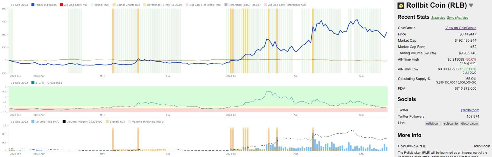
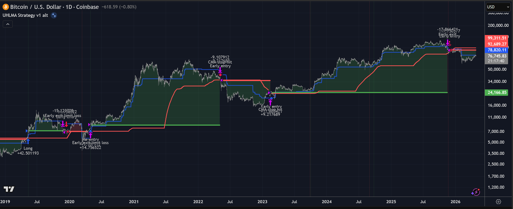
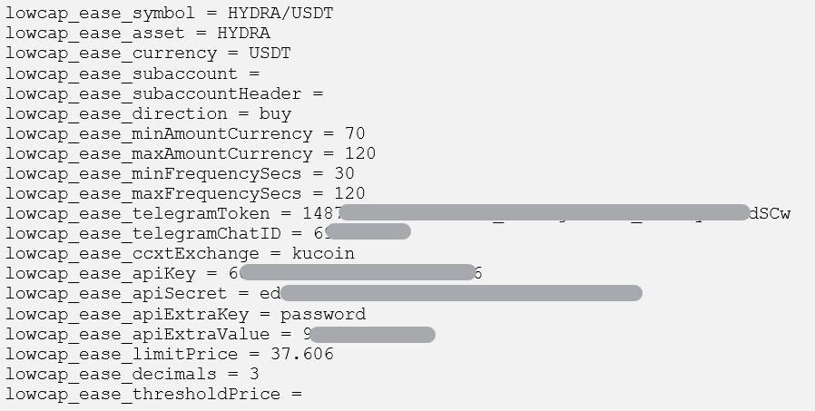
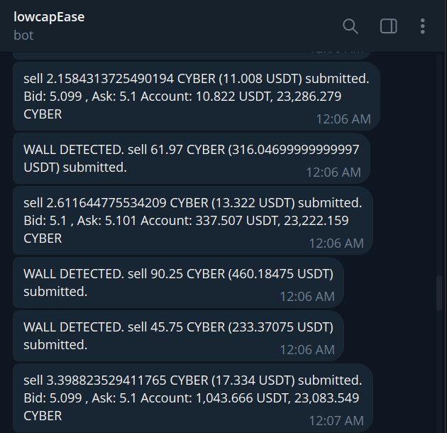

[TOC]

# Research / Playground

## [Market Maker Simulator](https://github.com/cryptomius/mm-parameter-lab)

A discrete-time ***\*Avellaneda–Stoikov\**** market-making simulator with a stress-scenario library, operating regime controller, toggleable risk interventions, and a real-time UI for poking the quoter mid-flight.

Built to test how the AS algorithm responds to various regimes (ie crypto vesting oversupply) and interventions with backtesting engine to compute statistical profitability of interventions. 

<kbd></kbd>

Link: [Market Maker Simulator & Parameter Lab on Github.com](https://github.com/cryptomius/mm-parameter-lab)

## Volume & Trend Scanner

Prototype built to quickly scan for early volume signals preceding large price movement. The system ingests daily price and volume data from Coingecko API, applies trend, BTC correlation & volume threshold algorithms, and stores locally for fast display of trading shortlist.

Volume threshold detector is a derivative of ATR with multiplier and trend is zig-zag algorithm based (HH, HL).

Other features include exchange-based liquidity snapshots, daily trending coin data, social media sentiment.

<kbd></kbd>

Link: Proprietary system (not public)

---
# Trading Indicators / Signals

## ["Crypto Cradle" ](https://www.tradingview.com/script/dIODLr62-Crypto-Cradle-v6/)

This is mean reversion trend-trading strategy taught by [@TraderCobb](https://twitter.com/TraderCobb). 

Combines trend, MACD, EMA proximity, and multi-timeframe analysis.

My closed-source [TradingView indicator](https://www.tradingview.com/script/dIODLr62-Crypto-Cradle-v6/) applies the pre-trade confirmation checklist criteria to highlight entry opportunities. It displays stop, entry & optional scale-out price levels for position size calculation.

<kbd></kbd>

Link: [Crypto Cradle Trigger on TradingView.com](https://www.tradingview.com/script/dIODLr62-Crypto-Cradle-v6/) 

## ["Explosive Potential" ](https://www.tradingview.com/script/rwBArbXJ-Explosive-Potential/)

This indicator looks at times where MACD is within a specified range (very close to 0 values) and price action is very constrained. Historically price has made a strong move after these conditions.

<kbd></kbd>

Link: [Explosive Potential on TradingView.com](https://www.tradingview.com/script/rwBArbXJ-Explosive-Potential/)

---
# Algorithmic Trading 

## Uhl MA Crossover Strategy (PineScript, NodeJS)

Strategy implementation of [Alex Glover's](https://www.tradingview.com/script/Hl1Sw0I4-Uhl-MA-Crossover-System/) adaptation of Andreas Uhl moving average formula (professor at Salzburg University). Essentially the algorithm attempts to minimise the frequency of slow vs fast moving average cross-overs during sideways market conditions. 

I converted the indicator into a strategy for backtesting and tested additional signal invalidation layers, loss mitigation, risk management & profit target methodologies.

I ran this strategy live on 4H and 8H candles across several high-liquidity crypto assets (spot for long, quarterly futures or perp futures for short) using segregated CEX sub-accounts. I wrote the infrastructure to calculate the strategy data from CEX API data and perform the trades directly (NodeJS with CCXT).

Monte Carlo simulations were positive, but real-world outcomes showed net sideways profitability so I put the live execution on ice.

<kbd></kbd>

Link: Proprietary system (not public)

# Trading Tools (Crypto)

## Lowcap Ease (NodeJS)

Proprietary tool to accumulate and exit large positions in low or itinerant liquidity environments. 

Buys/sells a random (range-bound) amount on a random (range-bound) periodic basis. 

Monitors orderbook and optionally fills large top-of-book orders if directionally aligned (above nominated threshold) to take advantage of itinerant liquidity. 

Reports progress via Telegram. CEX connectivity via CCXT.

<kbd></kbd>
<kbd></kbd>

## [Neutron blockchain bulk-sender](https://github.com/cryptomius/neutron-bulk-sender)
Written to perform bulk USDC transfers to Neutron blockchain recipients list (CSV).

Requires a Neutron blockchain wallet, RPC address, source wallet mnemonic phrase, and CSV containing destination address & amount pairs. 

The CSV will be updated with the transaction hash of the sent amount, which also avoids duplicate sending if the script gets interrupted.

---

Note: The scripts were written in 2018 an may no longer be compatible with Bitfinex APIs. They're included for portfolio purposes.

## [Bitfinex Auto-Stop](https://github.com/cryptomius/Bitfinex-Auto-Stop)

This script waits for your specified entry price, enters a trade position at your nominated size, then automatically protects the position with a stop order.

Link: [Bitfinex Auto-Stop (Node JS)](https://github.com/cryptomius/Bitfinex-Auto-Stop)

## [Bitfinex Auto-Stop & Target](https://github.com/cryptomius/Bitfinex-oco)

This script waits for your specified entry price (limit, stop, market order), enters the trade position, then automatically protects the position with a stop order and target for 100% to close the position when your stop or target are hit.

Link: [Bitfinex Auto-Stop (Node JS)](https://github.com/cryptomius/Bitfinex-oco)

## [Bitfinex Auto-Stop with 1:1 Scale-out](https://github.com/cryptomius/Bitfinex-Auto-Stop-121-Scale-Out)

This script waits for your specified entry price, enters a trade position, then automatically protects your position with a stop order and 1:1 scale-out order.

Link: [Bitfinex Auto-Stop with 1:1 Scale-out](https://github.com/cryptomius/Bitfinex-Auto-Stop-121-Scale-Out)
